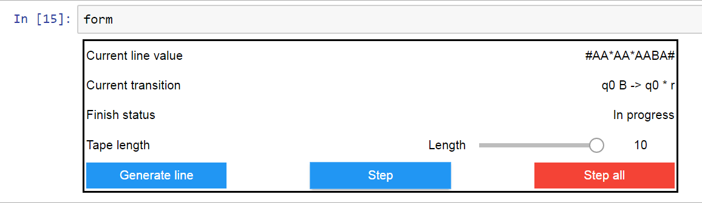

# TuringMachineWidgets

Simple use case of Jupyter Widgets on example of Turing machine simulator.
The task is: "An array of letters 'A' and 'B' is given.
It is necessary to compress the array by deleting all the letters 'B', but leaving the letters 'A'."
Jupyter Widgets are used to display the tape, current transition, status and command buttons.

### References
1. https://www.python-course.eu/turing_machine.php - implementation of Turing machine class.
2. http://ipywidgets.readthedocs.io/en/stable/index.html - Jupyter Widgets docs.